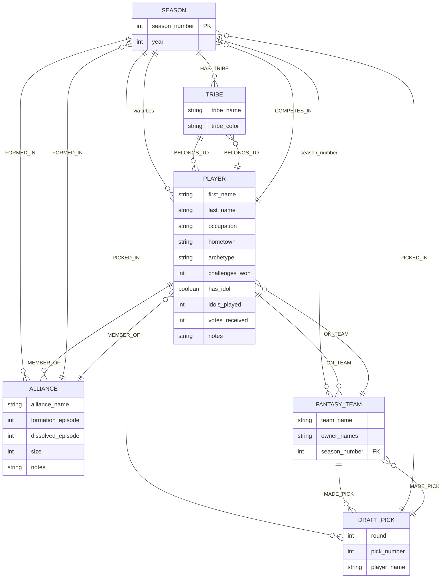

# Survivor Draft Data Model

## Entity Relationship Diagram

## Relationship Matrix

| From | To | Relationship | Purpose |
|------|----|----|---------|
| Season | Tribe | `HAS_TRIBE` | Groups tribes within a season |
| Tribe | Player | `BELONGS_TO` | Assigns players to their starting tribe |
| Player | Season | `COMPETES_IN` | Links players to seasons they appeared in |
| Season | Alliance | `FORMED_IN` | Groups alliances within a season |
| Alliance | Player | `MEMBER_OF` | Links players to alliances they joined |
| FantasyTeam | Player | `ON_TEAM` | **Draft roster** - tracks which players are on which fantasy team |
| FantasyTeam | DraftPick | `MADE_PICK` | Links fantasy team to its draft selections |
| DraftPick | Season | `PICKED_IN` | Links draft picks to the season they occurred in |

## Node Types & Properties

### Season
- **Properties:** `season_number` (int), `year` (int)
- **Primary Key:** `season_number`
- **Role:** Root node grouping all content for a specific Survivor season

### Tribe
- **Properties:** `tribe_name` (string), `tribe_color` (string/hex)
- **Primary Key:** `tribe_name` (unique within season via `HAS_TRIBE`)
- **Role:** Survivor starting tribes (e.g., "Mamanuca", "Naviti")

### Player
- **Properties:**
  - Basic: `first_name`, `last_name`, `occupation`, `hometown`, `archetype`, `notes`
  - Game stats: `challenges_won`, `has_idol`, `idols_played`, `votes_received`
- **Primary Key:** `(first_name, last_name)` compound key
- **Role:** Individual Survivor contestants

### Alliance
- **Properties:** `alliance_name`, `formation_episode`, `dissolved_episode`, `size`, `notes`
- **Primary Key:** `alliance_name` (unique within season via `FORMED_IN`)
- **Role:** In-game alliances formed during the season

### FantasyTeam
- **Properties:** `team_name`, `owner_names` (comma-separated), `season_number` (FK)
- **Primary Key:** `team_name` (unique within season via `season_number`)
- **Role:** Fantasy draft team tracking player selections

### DraftPick
- **Properties:** `round` (int), `pick_number` (int), `player_name` (string)
- **Purpose:** History tracking of draft selections
- **Role:** Immutable record of draft decisions

## Key Design Decisions

### 1. ON_TEAM Relationship (instead of DRAFTED_BY)
- Tracks current roster state
- Future-ready for trade functionality (trades would update `ON_TEAM` edges)
- Enables quick queries: "Which fantasy team has this player?"

### 2. DraftPick Node (History Tracking)
- Separate node for immutable draft history
- Stores `round` and `pick_number` for draft order tracking
- Allows future analytics: draft value tracking, reaching trades, etc.
- Combined with `ON_TEAM`, provides complete draft narrative

### 3. Compound Primary Keys
- **Player:** `(first_name, last_name)` - allows same name reuse across seasons
- **Tribe:** `tribe_name` with uniqueness constraint per season via `HAS_TRIBE`
- **FantasyTeam:** `team_name` with uniqueness per season via `season_number` property

### 4. Alliance Model
- Separate `MEMBER_OF` relationship from season participation
- Tracks multiple alliances per player per season
- Includes episode-level timeline data

### 5. Type Coercion Patterns
- Season numbers: Always pass as `Number()` to ensure integer matching
- Player names: Full name concatenation `(first_name + ' ' + last_name)` for uniqueness
- Comma-separated strings: `owner_names` parsed in validation layer

## Frozen Version
**Date:** December 10, 2025
**Status:** Production-ready, no further changes planned

This data model supports:
- ✅ Multi-season player tracking
- ✅ Fantasy team management with draft history
- ✅ Alliance analytics
- ✅ Player statistics and metadata
- ✅ Future trade system (via ON_TEAM edge updates)
- ✅ Complete draft audit trail (via DraftPick nodes)